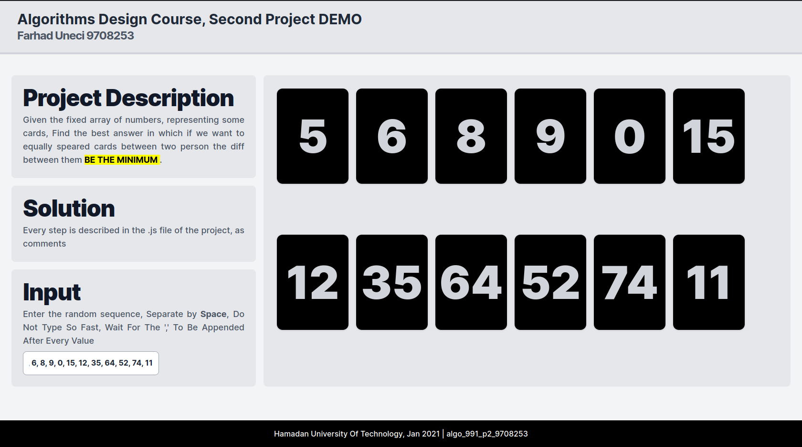
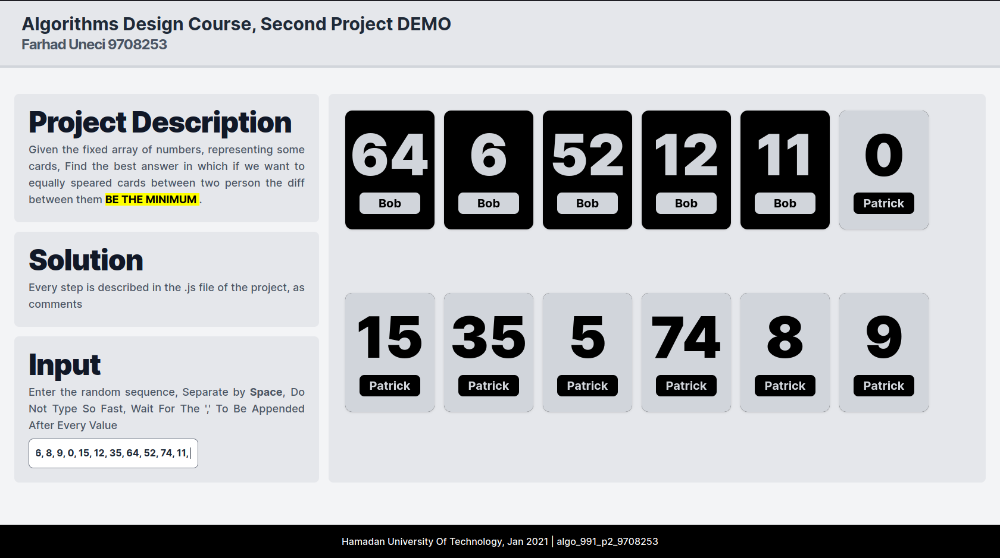

# Hamedan University of Tech. Algorithms Design Course Final Project

## Project Description

Given the fixed array of numbers, representing some cards, Find the best answer in which if we want to equally speared cards between these two people, the difference between the sums *"Be the minimum"* possible amount.

## Demo

Suppose the first person is called Bob and the other Patrick, so the best possible ordering of cards between them (so the difference between the sum of those cards be the min amount) is represented by different coloring for each person.

## How to see this is the action?

Just clone the repo and open `index.html` file located in `Second_project` folder in your browser!
